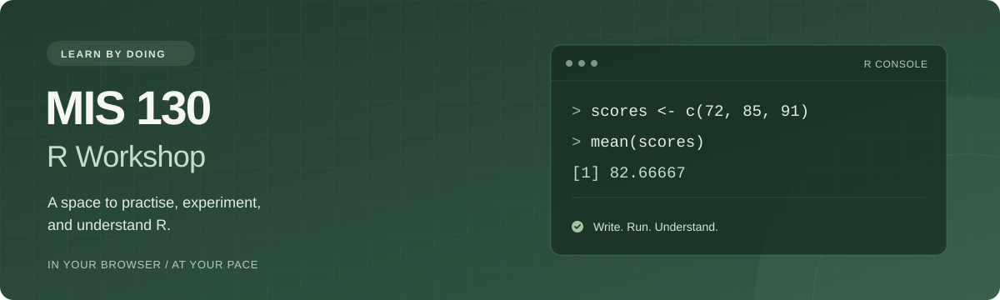
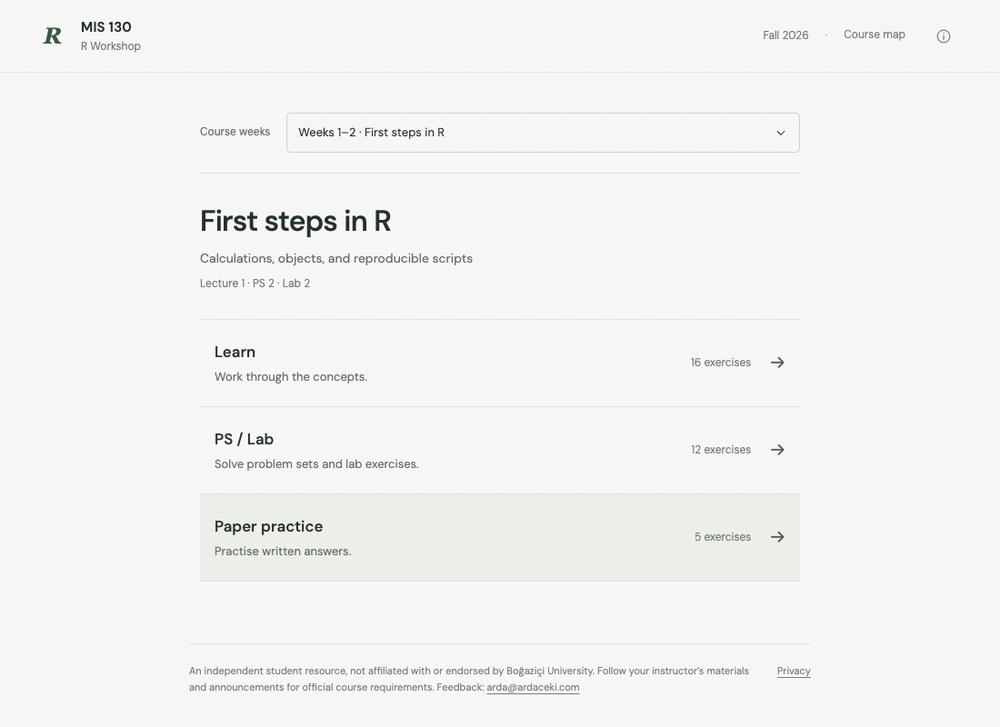
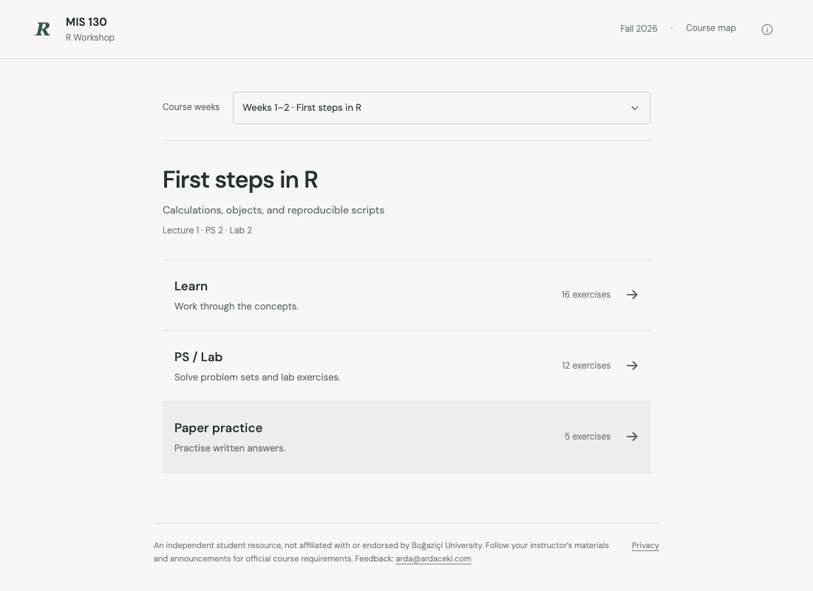
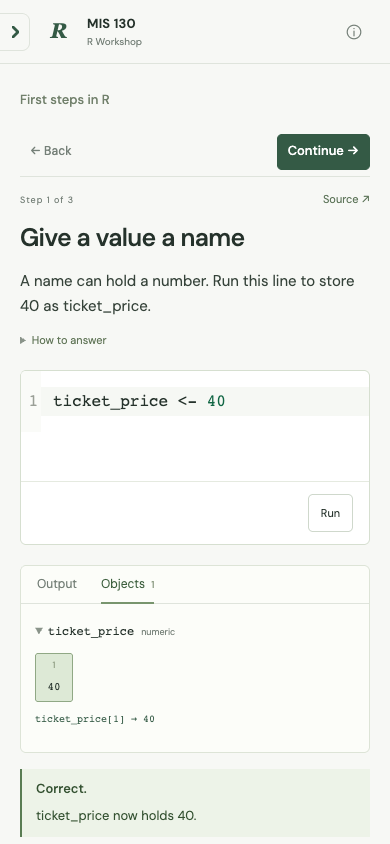

<p align="center">
  
</p>

<p align="center">
  <strong>Learn R by running it.</strong><br>
  An independent study companion for MIS 130 at Boğaziçi University.<br>
  Real R in your browser. Exercises, feedback, and exam practice. No installation or account.
</p>

<p align="center">
  <a href="https://mis130.site"><strong>Open the workshop ↗</strong></a>
  &nbsp; · &nbsp;
  <a href="#quick-start">Run locally</a>
  &nbsp; · &nbsp;
  <a href="docs/DEVELOPMENT.md">Developer guide</a>
</p>

<p align="center">
  <a href=".nvmrc"></a>
  <a href="LICENSE"></a>
  <a href="https://docs.r-wasm.org/webr/latest/"></a>
</p>

---

## Inside the workshop

Write code, run it, and inspect the result without leaving the exercise. Get
feedback on your answer, use a hint when you need one, and compare your approach
with the solution.



| Learn the concepts                                       | Put them into practice                                          | Prepare for exams                                                            |
| -------------------------------------------------------- | --------------------------------------------------------------- | ---------------------------------------------------------------------------- |
| Short exercises and guided steps, starting with `1 + 1`. | Problem sets and labs with answer checks, hints, and solutions. | Output predictions and written questions with model answers for self-review. |

The results panel shows console output, plots, vectors, matrices, and data-frame
cells. The editor uses CodeMirror; R runs through webR 0.6.0.

### Current coverage

**73 tasks · 2 topic groups · 3 ways to practise**

| Topic              | Focus                                           |
| ------------------ | ----------------------------------------------- |
| First steps in R   | Calculations, objects, and reproducible scripts |
| Syntax and objects | Vectors, lists, matrices, and data frames       |

Later topics appear in the course map; their exercises are not yet published.

<details>
<summary><strong>Explore the home screen and mobile view</strong></summary>

<br>



<p align="center">
  
</p>

</details>

## Quick start

Use the Node.js version pinned in [`.nvmrc`](.nvmrc). With nvm installed:

```sh
nvm use
npm ci
npm run dev
```

Open **[localhost:5173](http://127.0.0.1:5173)**. An internet connection is needed
to load R and the external font. `npm run build` creates the static site in `dist/`.

### Development commands

| Command                      | Purpose                                                          |
| ---------------------------- | ---------------------------------------------------------------- |
| `npm run dev`                | Start the local development server                               |
| `npm run check`              | Check formatting, lint, verification tooling, sources, and build |
| `npm test`                   | Run the browser regression suite                                 |
| `npm run test:production`    | Check the production build with real R                           |
| `npm run check:reproducible` | Compare the output of two consecutive builds                     |

See [Contributing](CONTRIBUTING.md) for the change workflow and
[Validation](docs/VALIDATION.md) for what has been tested and its limits.

## Verify what is live

You can independently compare the site's files with a build from this repository.
From a clean checkout of the intended release commit, using the exact Node.js
version in `.nvmrc`:

```sh
npm ci
npm run build
npm run verify:deployment -- https://mis130.site
```

The verifier compares **every rebuilt static file** with the site's response,
including HTML, JavaScript, CSS, source materials, and licences. Expected SHA-256
hashes come from your own build. Any mismatch exits with an error.

GitHub Actions runs the checks on pushes and pull requests. Cloudflare is connected
directly to `main`: it builds and tests the code before deployment, then checks
the live files and R behavior. See the
[verification details and limits](docs/DEVELOPMENT.md#independent-deployment-verification).

## How the project is organised

```text
src/
  main.js          Feature wiring and URL routing
  application/     Run/Stop, cancellation, and execution feedback
  ui/              Home, lessons, editor, results, navigation, dialogs
  content/         Exercises, guided steps, answer checks, source mappings
  styles/          Component styles and responsive/motion rules
  runtime.js       Browser R lifecycle and result serialization
  feedback.js      Answer contracts and diagnostic explanations
tests/             Browser regression suite and production smoke
scripts/           Source checks, build verification, and production preview
docs/              Development, validation, content rights, and demo media
public/sources/    Original course materials
```

## Work and privacy

Code, checks, and the virtual filesystem run inside the browser. Drafts stay in
page memory: returning home preserves them; reloading clears them. The application
stores no answers or progress and creates no account or application cookies.

Opening a coding exercise downloads R in the background. Code runs after you
press **Run**. Each attempt recreates its workspace objects and task files and
restores the initial R options. webR, Google Fonts, and the hosting provider
receive the requests needed to serve the site. Read the
[privacy page](https://mis130.site/privacy.html) for details.

## Credits and licence

Created by **[Arda Çeki](https://github.com/ardaceki)** as an independent student
project. Teaching materials are credited to **Fahrettin Çakır** and the authors
identified in each source. This is not an official or endorsed university website.

Original application code is licensed under the **[MIT License](LICENSE)**.
Original teaching materials and course-derived educational content remain with
their respective authors and are not relicensed by this project.
[Content rights](docs/CONTENT_RIGHTS.md) records source attribution and third-party
software licences.
